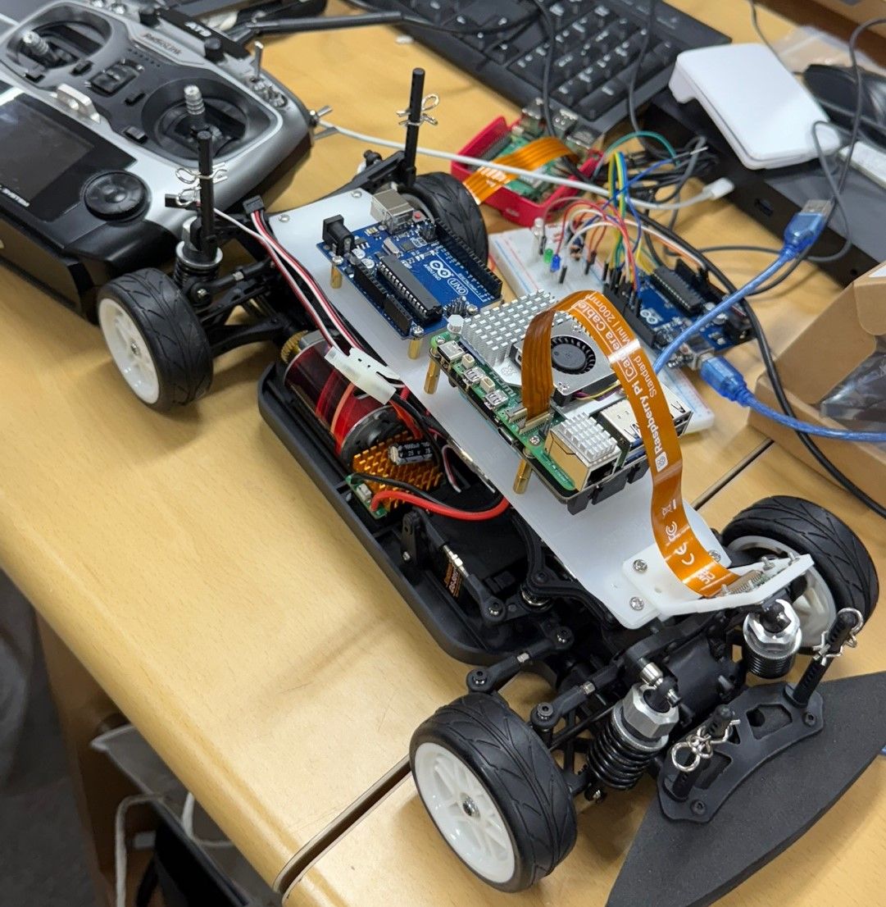

# RC Car Line-Tracing System (Raspberry Pi + Arduino)

## 팀 구성원
- 202301645 김예진, 202301667 정이지

## 📌 프로젝트 개요
이 프로젝트는 **Raspberry Pi**와 **Arduino** 간의 시리얼 통신을 기반으로, 라인트레이싱 기능을 수행하는 자율주행 RC카를 구현한 것입니다.  
Raspberry Pi에서는 **Picamera2**로 촬영한 영상을 실시간으로 처리하여 조향값을 계산하고,  
Arduino는 수신한 값을 기반으로 실제 RC카의 조향 및 속도 제어를 수행합니다.

---
## 준비물

- DS-S012 서보모터
- ESC (Electronic Speed Controller)
- DC 모터
- RC카 섀시
- Raspberry Pi (Picamera2 호환 모델)
- Arduino (ATmega 기반)
- AI 카메라 (Picamera2)
- R9DS 수신기
- AT9 Radiolink 조종기



---

## 코드별 동작 원리

###  Python 코드 (Raspberry Pi - `streaming.py`)
- **Flask 웹 서버**를 실행하여 `/video_feed` 경로로 영상 스트리밍 제공
- **Picamera2**로 프레임 캡처 → OpenCV로 **엣지 검출 및 기울기 계산**
- 하단부(Near)와 상단부(Far) 대표 라인을 추출하고, 중심좌표 및 기울기(각도) 계산
- 이 값들을 이용해 조향 변수(`steer`)를 계산한 뒤 **시리얼 포트를 통해 Arduino에 전달**
- 이전에 보낸 값과 다를 경우에만 전송 → 불필요한 통신 방지

###  Arduino 코드 (`pwm.ino`)
- **모드 선택(PWM 입력 CH9)**: 자동 모드(AUTO)와 수동 모드(MANUAL) 구분
- **수동 모드(MANUAL)**
  - 조종기에서 수신한 PWM 신호(CH1: 조향, CH2: 속도)를 읽어 서보 및 ESC를 제어
  - 조향 각도에 따라 좌우 방향 LED 점등 
    
    * 좌회전 시 왼쪽 LED 점등
    * 우회전 시 오른쪽 LED 점등
    * 직진 시 LED 미점등
    * 후진 시 양쪽 LED 점등

    
- **자동 모드(AUTO)**
  - Raspberry Pi로부터 시리얼 통신을 통해 전달받은 값에 따라 조향 각도를 설정
  - `"N/A"`일 경우, 짧게 후진 후 중립 상태로 복귀
  - 숫자(0~180)는 해당 각도로 조향 후, 고정 속도로 전진 (`1550μs`)
  - 조향 방향에 따라 LED 점등

      
    * 좌회전 시 왼쪽 LED 점등
    * 우회전 시 오른쪽 LED 점등
    * 직진 시 LED 미점등
    * 후진 시 양쪽 LED 점등

---

## 이미지 처리 및 라인트레이싱 제어 방법

### 1. ROI 설정
- 영상 프레임의 세로 30%~80% 구간만 관심 영역(ROI)으로 설정

### 2. 엣지 검출
- ROI에서 Canny Edge Detection을 통해 도로선 엣지 추출
- Morphological Dilation으로 엣지 확장 후, HoughLinesP로 직선 검출

### 3. 대표 라인 추출
- 검출된 직선 중 `y > 200` → 하단 대표선(Near)
- 검출된 직선 중 `y ≤ 200` → 상단 대표선(Far)

### 4. 조향값 계산
- 각 대표선에서 중심 X좌표 및 기울기(각도)를 계산
- 최종 조향값(`steer`)은 다음과 같은 가중합으로 계산됨:
  ```text
  steer = 0.7 * near_x + 0.2 * near_angle + 0.1 * far_angle


아래 표와 간단한 시퀀스 다이어그램으로 라즈베리파이(Pi)와 아두이노(Arduino) 간 시리얼 통신 프로토콜을 정리했습니다.

---

#### 📊 통신 프로토콜 요약

| 방향               | 메시지 내용        | 포맷 예시                 | 전송 조건              | 설명                                             |
| ---------------- | ------------- | --------------------- | ------------------ | ---------------------------------------------- |
| **Pi → Arduino** | 조향값 또는 후진 신호  | `"85\n"`<br>`"N/A\n"` | `steer` 값이 변경될 때마다 | Pi에서 계산한 `steer` 값을 문자열로 전송. `N/A`는 후진 처리.     |
| **Arduino → Pi** | 받은 메시지 그대로 에코 | `85`                  | 수신할 때마다            | Arduino `Serial.println()` 으로 받은 값을 그대로 다시 보냄. |

---

#### 🔄 시퀀스 다이어그램 (ASCII)

```
Pi (Python)                         Arduino (C++)

/dev/ttyACM0 open                    Serial.begin(9600)
       │                                       │
       │───[계산된 steer] "85\n"───────────────▶│  // arduino.readStringUntil('\n')
       │                                       │
       │                                       │─┐
       │                                       │ ├─ processSerialInput("85")
       │                                       │ └─ steeringServo.write(85), ESC 제어
       │                                       │
       │◀───────[echo] "85\r\n"────────────────│  // Serial.println(command)
       │                                       │
(readline)│                                       │
       │                                       │
(repeat when changed)                          loop
```

* **1단계**: Pi 측 Python 코드가 `steer` 값을 계산 후 `"숫자\n"` 또는 `"N/A\n"` 형태로 전송
* **2단계**: Arduino 측에서 `Serial.readStringUntil('\n')` 로 메시지를 수신하고, `processSerialInput()` 에서 조향·속도 로직 실행
* **3단계**: Arduino가 `Serial.println()` 으로 수신된 값을 그대로 다시 에코(echo)
* **4단계**: Pi 측에서 `arduino.readline()` 으로 에코된 값을 읽어 디버깅용으로 출력

이 구조 덕분에

* Pi는 항상 “마지막으로 보낸 값”과 비교하여 **변경된 경우에만** 전송 → 불필요한 트래픽 최소화
* Arduino는 간단한 문자열 기반 프로토콜로 **양방향 상태 확인** 가능


아래에 표와 함께 **Mermaid** 다이어그램을 이용한 시퀀스 흐름을 그려 보았습니다.

---

#### 📊 통신 프로토콜 요약

| 방향               | 메시지 내용        | 포맷 예시                 | 전송 조건              | 설명                                          |
| ---------------- | ------------- | --------------------- | ------------------ | ------------------------------------------- |
| **Pi → Arduino** | 조향값 또는 후진 신호  | `"85\n"`<br>`"N/A\n"` | `steer` 값이 변경될 때마다 | Pi가 계산한 `steer` 값을 문자열로 전송. `N/A`는 후진 처리.   |
| **Arduino → Pi** | 받은 메시지 그대로 에코 | `85`                  | 수신할 때마다            | Arduino가 `Serial.println()` 으로 받은 값을 다시 보냄. |

---

##  수동 모드 동작 영상
[](https://youtube.com/shorts/-j2qshY9Nfc?feature=share)
